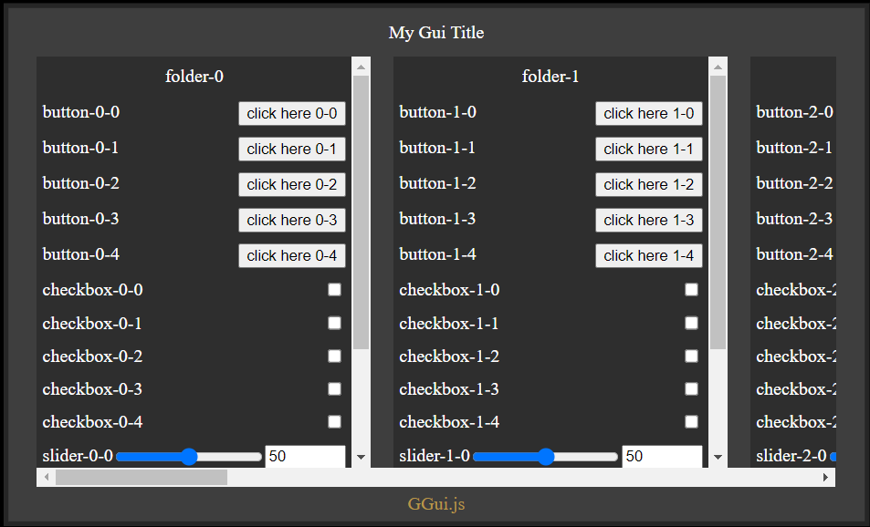

# GGui.js

GGui.js is a TypeScript GUI library designed to simplify the creation of graphical user interfaces for web applications. With GGui.js, you can easily create folders and add components such as buttons, checkboxes, and sliders to organize and enhance your user interface. This library is intended for desktop applications.

_Inspired by dat.gui & guify_

## Installation

To use GGui.js in your project, can import the source code located within this directory at GGui.js. For TypeScript you can copy over the src/lib folder into your project. I plan to add this library to a proper cdn as well as include types.

TODO:

<!-- ```bash
npm install ggui.js
``` -->

## Usage

### Importing GGui.js

```typescript
import GGUI from 'path';
```

### Creating a GUI

```typescript
const GUI = GGUI.GUI;

const gui = new GUI({
    title: 'My Gui Title',
});
```

### Adding Folders and Components

```typescript
import { Folder, Button, CheckBox, RangeSlider, ColorWheel, FileUpload } from 'path';

const folder = new Folder({
    name: 'my folder',
});

folder.addComponent(
    new Button({
        title: 'my button',
        label: 'Click Here',
        onClick: () => {
            console.log('Button clicked');
        },
    })
);

folder.addComponent(
    new CheckBox({
        title: 'my checkbox',
        onChange: active => {
            console.log('Checkbox toggle state', active);
        },
    })
);

folder.addComponent(
    new RangeSlider({
        title: 'my slider',
        min: 0,
        max: 100,
        value: 50,
        step: 1,
        onChange: value => {
            console.log('Slider changed', value);
        },
    })
);

folder.addComponent(
    new ColorWheel({
        title: 'my color wheel',
        onChange: color => {
            console.log('Color wheel changed', color);
        },
    })
);

folder.addComponent(
    new FileUpload({
        title: 'my file upload',
        multiple: true, // accept multiple files
        onChange: file => {
            console.log('File uploaded', file);
        },
    })
);

// Add the folder to the GUI
gui.addFolder(folder);
```

### Initializing the GUI

```typescript
gui.init();
```

<!-- ## Demo

```typescript
// Code to create folders and add components
``` -->

## Screenshot


