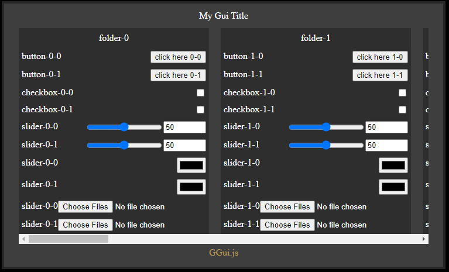

# GGui.js

GGui.js is a TypeScript GUI library designed to simplify the creation of graphical user interfaces for web applications. With GGui.js, you can easily create folders and add components such as buttons, checkboxes, and sliders to organize and enhance your user interface. This library is intended for desktop applications.

_Inspired by dat.gui & guify_

## Installation

To use GGui.js in your project, you can copy over the build file or import it through cnd:

TODO:

<!-- ```bash
npm install ggui.js
``` -->

## Usage

### Importing GGui.js

```typescript
import GGUI from 'path';
```

### Creating a GUI

```typescript
const GUI = GGUI.GUI;
const gui = new GUI({
    title: 'My Gui Title',
});
```

### Adding Folders and Components

```typescript
import { Folder, Button, CheckBox, RangeSlider } from 'path';

const folder = new Folder({
    name: 'folder-1',
});

folder.addComponent(
    new Button({
        title: 'button-1',
        label: 'Click Here',
        onClick: () => {
            console.log('Button clicked');
        },
    })
);

folder.addComponent(
    new CheckBox({
        title: 'checkbox-1',
        onChange: active => {
            console.log('Checkbox toggled', active);
        },
    })
);

folder.addComponent(
    new RangeSlider({
        title: 'slider-1',
        min: 0,
        max: 100,
        value: 50,
        step: 1,
        onChange: value => {
            console.log('Slider changed', value);
        },
    })
);

gui.addFolder(folder);
```

### Initializing the GUI

```typescript
gui.init();
```

<!-- ## Demo

```typescript
// Code to create folders and add components
``` -->

## Screenshot


